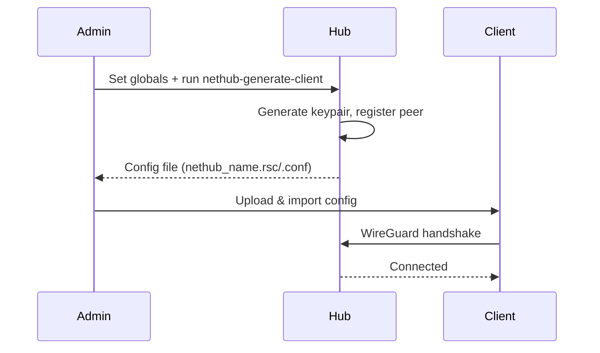

# K2O-NETHUB - WireGuard Hub Manager

[](README.md)
[](README.uk.md)

**v5.0** | RouterOS 7.x | WireGuard | Multi-Platform

Single-file deployment for WireGuard VPN hub with multi-platform client support and policy-based routing.

## Network Architecture

```
Hub Network: 10.254.0.0/24
├── Hub:       10.254.0.1
├── Client 1:  10.254.0.11
├── Client 2:  10.254.0.12
├── ...
└── Client N:  10.254.0.(10+N)  (max 244 clients)
```

## Routing Modes

| Mode | Platform | Description |
|------|----------|-------------|
| `pbr` | RouterOS only | Policy-based routing with address-lists |
| `dgw` | Non-ROS | Default gateway - all traffic via tunnel (internet only) |
| `selective` | Non-ROS | Specific networks via tunnel |

### PBR Mode (RouterOS)

Policy-based routing using four address-lists:

| List | Purpose |
|------|---------|
| `SRCviaWG` | Source addresses routed via WG |
| `DSTviaWG` | Destination addresses routed via WG |
| `SRCtoAVOIDviaWG` | Source addresses NOT routed via WG |
| `DSTtoAVOIDviaWG` | Destination addresses NOT routed via WG |

Generated config includes disabled example entries for documentation.

### DGW Mode (Non-RouterOS)

- All traffic via tunnel
- Client gets `/32` address for isolation from other clients
- Access to internet only, NO access to other NETHUB networks
- **Admin option**: Set `nethubGenAdmin "yes"` to get `/24` address and hub network access

### Selective Mode (Non-RouterOS)

- Only specified networks via tunnel
- If no networks provided: warning on first run, minimal config (server-only) on second run
- Pass `"dgw"` as networks to switch to DGW mode
- **Admin option**: Set `nethubGenAdmin "yes"` to include hub network in AllowedIPs

## Supported Platforms

| Platform | Output | Modes |
|----------|--------|-------|
| RouterOS | `.rsc` config with management scripts | pbr |
| Windows/macOS | `.conf` file | dgw, selective |
| iOS/Android | `.conf` file | dgw, selective |
| Linux | `.conf` + `.sh` install scripts | dgw, selective |

## Quick Start

### 1. Deploy Hub

```routeros
# Edit nethub_server_deploy.rsc - set your FQDN:
:global nethubFQDN "vpn.example.com"

# Upload and import:
/import nethub_server_deploy.rsc
```

### 2. Generate Client

**RouterOS (PBR mode):**
```routeros
:global nethubGenName "office"
:global nethubGenPlatform "ros"
/system script run nethub-generate-client
```

**Non-RouterOS (DGW mode):**
```routeros
:global nethubGenName "myphone"
:global nethubGenPlatform "ios"
:global nethubGenMode "dgw"
/system script run nethub-generate-client
```

**Non-RouterOS (Selective mode):**
```routeros
:global nethubGenName "laptop"
:global nethubGenPlatform "win"
:global nethubGenMode "selective"
:global nethubGenNetworks "192.168.10.0/24,10.20.0.0/16"
/system script run nethub-generate-client
```

**Non-RouterOS (Admin mode - hub network access):**
```routeros
:global nethubGenName "admin-phone"
:global nethubGenPlatform "ios"
:global nethubGenMode "dgw"
:global nethubGenAdmin "yes"
/system script run nethub-generate-client
```

### 3. Deploy Client

**RouterOS:**
```routeros
/import nethub_office.rsc
```

After deployment, add addresses to control routing:
```routeros
/ip firewall address-list add list=SRCviaWG address=192.168.10.0/24
/ip firewall address-list add list=DSTviaWG address=8.8.8.8
```

**Non-RouterOS:**
Import the `.conf` file into your WireGuard client.

## How It Works



## Hub Management Scripts

| Script | Purpose |
|--------|---------|
| `nethub-status` | Shows hub status |
| `nethub-generate-client` | Generates client config |
| `nethub-client-list` | Lists all clients with status |
| `nethub-client-remove` | Removes a client |
| `nethub-uninstall` | Removes NETHUB (blocked if clients connected) |

## Client Scripts (RouterOS)

| Script | Purpose |
|--------|---------|
| `nethub-status` | Shows connection status |
| `nethub-uninstall` | Removes NETHUB (requires 3 runs) |

## PBR Routing (RouterOS)

After deploying client, add addresses to control routing:

```routeros
# Route traffic FROM specific sources via WG
/ip firewall address-list add list=SRCviaWG address=192.168.10.0/24

# Route traffic TO specific destinations via WG
/ip firewall address-list add list=DSTviaWG address=8.8.8.8

# EXCLUDE specific traffic from WG routing
/ip firewall address-list add list=DSTtoAVOIDviaWG address=1.1.1.1
```

Without any addresses in lists: only hub ↔ client communication works.

## Configuration

### Hub Variables

Edit these in `nethub_server_deploy.rsc`:

| Variable | Default | Description |
|----------|---------|-------------|
| `nethubName` | `hub1` | Hub identifier (used in DNS names) |
| `nethubFQDN` | `hub.example.com` | Public IP or domain |
| `nethubWgPort` | `51820` | WireGuard UDP port |
| `nethubNetwork` | `10.254.0.0/24` | Tunnel network |
| `nethubServerIP` | `10.254.0.1` | Hub IP in tunnel |
| `nethubClientStart` | `11` | First client IP suffix |

### Client Generation Parameters

| Parameter | Required | Values | Default | Description |
|-----------|----------|--------|---------|-------------|
| `nethubGenName` | **Yes** | string | - | Client identifier (unique) |
| `nethubGenPlatform` | No | ros/win/mac/linux/ios/android | ros | Target platform |
| `nethubGenMode` | No | pbr/dgw/selective | pbr (ros), selective (other) | Routing mode |
| `nethubGenNetworks` | No | comma-separated or "dgw" | - | Networks for selective mode |
| `nethubGenAdmin` | No | yes/true | - | Allow hub network access (dgw/selective) |

## Requirements

**Hub:**
- RouterOS 7.x
- Static IP or DDNS
- Port 51820/UDP open

**Client:**
- RouterOS 7.x, Windows, macOS, Linux, iOS, or Android
- WireGuard client (non-RouterOS)
- Outbound access to hub on 51820/UDP

## Known Limitations

| Limitation | Impact |
|------------|--------|
| Max 244 clients | IP range: 10.254.0.11 - 10.254.0.254 |
| PBR mode | RouterOS only (requires policy routing) |
| DGW isolation | Clients can't see each other (by design) |
| No concurrent protection | Don't run generate-client simultaneously |

## Verification

```routeros
# Hub status:
/system script run nethub-status

# Client list:
/system script run nethub-client-list

# WireGuard peers:
/interface wireguard peers print detail where comment~"NETHUB"
```

## Troubleshooting

<details>
<summary>Tunnel not connecting</summary>

```routeros
# On client - check endpoint:
/interface wireguard peers print detail

# On hub - verify peer exists:
/interface wireguard peers print detail where comment~"NETHUB"

# Check firewall:
/ip firewall filter print where dst-port=51820
```

</details>

<details>
<summary>PBR routing not working</summary>

```routeros
# Check address lists:
/ip firewall address-list print where list~"viaWG"

# Check mangle rules:
/ip firewall mangle print where comment~"NETHUB"

# Check routing table:
/routing table print where name=nethub-route
```

</details>

<details>
<summary>Remove client</summary>

```routeros
:global nethubRemoveName "clientname"
/system script run nethub-client-remove
```

</details>

<details>
<summary>Full cleanup (hub)</summary>

```routeros
/system script run nethub-uninstall
# Run 3 times to confirm
```

</details>

## Upgrade from MVSM

If you have an existing MVSM installation (v3/v4), use the upgrade script:

```routeros
/import nethub_upgrade.rsc
```

The upgrade script will:
- Preserve all existing peers, keys, and IP assignments
- Rename interface `wg_mvsm` → `wg_nethub`
- Update comments `MVSM` → `NETHUB`
- Deploy new management scripts v5.0
- Keep your custom network/port settings

**No client reconfiguration needed** — existing clients will continue to work.

## Files

| File | Description |
|------|-------------|
| `nethub_server_deploy.rsc` | Fresh hub deployment script |
| `nethub_upgrade.rsc` | Upgrade from MVSM v3/v4 to NETHUB v5.0 |
| `.specify/specs/020-routing-modes-v2/` | Routing modes specification |
| `README.md` | Documentation (English) |
| `README.uk.md` | Documentation (Ukrainian) |

## Support

- Telegram: [@olekovin](https://t.me/olekovin)
- GitHub Issues
