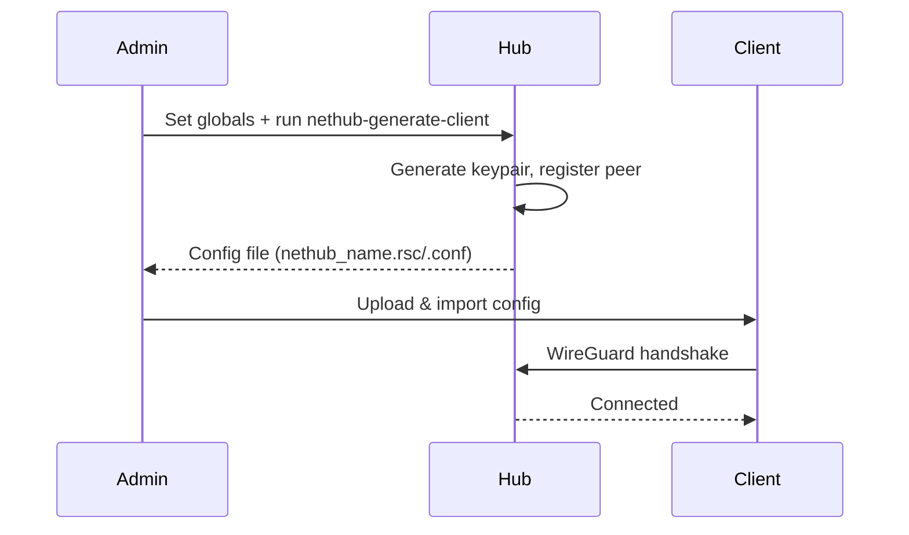

# K2O-NETHUB - WireGuard Hub Manager

[](README.md)
[](README.uk.md)

**v5.0** | RouterOS 7.x | WireGuard | Multi-Platform

Single-file deployment для WireGuard VPN хабу з підтримкою багатьох платформ та policy-based routing.

## Мережева архітектура

```
Hub Network: 10.254.0.0/24
├── Hub:       10.254.0.1
├── Client 1:  10.254.0.11
├── Client 2:  10.254.0.12
├── ...
└── Client N:  10.254.0.(10+N)  (макс. 244 клієнти)
```

## Режими маршрутизації

| Режим | Платформа | Опис |
|-------|-----------|------|
| `pbr` | Тільки RouterOS | Policy-based routing з address-lists |
| `dgw` | Non-ROS | Default gateway - весь трафік через тунель (тільки інтернет) |
| `selective` | Non-ROS | Вибіркові мережі через тунель |

### PBR режим (RouterOS)

Policy-based routing з чотирма address-lists:

| Список | Призначення |
|--------|-------------|
| `SRCviaWG` | Source адреси, що маршрутизуються через WG |
| `DSTviaWG` | Destination адреси, що маршрутизуються через WG |
| `SRCtoAVOIDviaWG` | Source адреси, що НЕ маршрутизуються через WG |
| `DSTtoAVOIDviaWG` | Destination адреси, що НЕ маршрутизуються через WG |

Згенерований конфіг містить вимкнені приклади для документації.

### DGW режим (Non-RouterOS)

- Весь трафік через тунель
- Клієнт отримує `/32` адресу для ізоляції від інших клієнтів
- Доступ тільки до інтернету, БЕЗ доступу до інших NETHUB мереж

### Selective режим (Non-RouterOS)

- Тільки вказані мережі через тунель
- Якщо мережі не вказані: попередження при першому запуску, мінімальний конфіг (тільки сервер) при другому
- Передайте `"dgw"` як networks для переключення в DGW режим

## Підтримувані платформи

| Платформа | Вихід | Режими |
|-----------|-------|--------|
| RouterOS | `.rsc` конфіг з management scripts | pbr |
| Windows/macOS | `.conf` файл | dgw, selective |
| iOS/Android | `.conf` файл | dgw, selective |
| Linux | `.conf` + `.sh` install scripts | dgw, selective |

## Швидкий старт

### 1. Деплой хабу

```routeros
# Відредагуйте nethub_server_deploy.rsc - встановіть ваш FQDN:
:global nethubFQDN "vpn.example.com"

# Завантажте та імпортуйте:
/import nethub_server_deploy.rsc
```

### 2. Генерація клієнта

**RouterOS (PBR режим):**
```routeros
:global nethubGenName "office"
:global nethubGenPlatform "ros"
/system script run nethub-generate-client
```

**Non-RouterOS (DGW режим):**
```routeros
:global nethubGenName "myphone"
:global nethubGenPlatform "ios"
:global nethubGenMode "dgw"
/system script run nethub-generate-client
```

**Non-RouterOS (Selective режим):**
```routeros
:global nethubGenName "laptop"
:global nethubGenPlatform "win"
:global nethubGenMode "selective"
:global nethubGenNetworks "192.168.10.0/24,10.20.0.0/16"
/system script run nethub-generate-client
```

### 3. Деплой клієнта

**RouterOS:**
```routeros
/import nethub_office.rsc
```

Після деплою додайте адреси для контролю маршрутизації:
```routeros
/ip firewall address-list add list=SRCviaWG address=192.168.10.0/24
/ip firewall address-list add list=DSTviaWG address=8.8.8.8
```

**Non-RouterOS:**
Імпортуйте `.conf` файл у ваш WireGuard клієнт.

## Як це працює



## Скрипти управління хабом

| Скрипт | Призначення |
|--------|-------------|
| `nethub-status` | Показує статус хабу |
| `nethub-generate-client` | Генерує конфіг клієнта |
| `nethub-client-list` | Список всіх клієнтів зі статусом |
| `nethub-client-remove` | Видаляє клієнта |
| `nethub-uninstall` | Видаляє NETHUB (блокується якщо клієнти підключені) |

## Клієнтські скрипти (RouterOS)

| Скрипт | Призначення |
|--------|-------------|
| `nethub-status` | Показує статус підключення |
| `nethub-uninstall` | Видаляє NETHUB (потребує 3 запуски) |

## PBR маршрутизація (RouterOS)

Після деплою клієнта додайте адреси для контролю маршрутизації:

```routeros
# Маршрутизувати трафік ВІД конкретних джерел через WG
/ip firewall address-list add list=SRCviaWG address=192.168.10.0/24

# Маршрутизувати трафік ДО конкретних призначень через WG
/ip firewall address-list add list=DSTviaWG address=8.8.8.8

# ВИКЛЮЧИТИ конкретний трафік з WG маршрутизації
/ip firewall address-list add list=DSTtoAVOIDviaWG address=1.1.1.1
```

Без адрес у списках: працює тільки зв'язок hub <-> client.

## Конфігурація

### Змінні хабу

Редагуйте їх у `nethub_server_deploy.rsc`:

| Змінна | За замовч. | Опис |
|--------|------------|------|
| `nethubName` | `hub1` | Ідентифікатор хабу (використовується в DNS іменах) |
| `nethubFQDN` | `hub.example.com` | Публічний IP або домен |
| `nethubWgPort` | `51820` | WireGuard UDP порт |
| `nethubNetwork` | `10.254.0.0/24` | Тунельна мережа |
| `nethubServerIP` | `10.254.0.1` | IP хабу в тунелі |
| `nethubClientStart` | `11` | Суфікс IP першого клієнта |

### Параметри генерації клієнта

| Параметр | Обов'язковий | Значення | За замовч. | Опис |
|----------|--------------|----------|------------|------|
| `nethubGenName` | **Так** | string | - | Ідентифікатор клієнта (унікальний) |
| `nethubGenPlatform` | Ні | ros/win/mac/linux/ios/android | ros | Цільова платформа |
| `nethubGenMode` | Ні | pbr/dgw/selective | pbr (ros), selective (інші) | Режим маршрутизації |
| `nethubGenNetworks` | Ні | через кому або "dgw" | - | Мережі для selective режиму |

## Вимоги

**Хаб:**
- RouterOS 7.x
- Статичний IP або DDNS
- Порт 51820/UDP відкритий

**Клієнт:**
- RouterOS 7.x, Windows, macOS, Linux, iOS або Android
- WireGuard клієнт (для non-RouterOS)
- Вихідний доступ до хабу на 51820/UDP

## Відомі обмеження

| Обмеження | Вплив |
|-----------|-------|
| Макс. 244 клієнти | Діапазон IP: 10.254.0.11 - 10.254.0.254 |
| PBR режим | Тільки RouterOS (потребує policy routing) |
| DGW ізоляція | Клієнти не бачать один одного (за дизайном) |
| Без concurrent protection | Не запускайте generate-client одночасно |

## Перевірка

```routeros
# Статус хабу:
/system script run nethub-status

# Список клієнтів:
/system script run nethub-client-list

# WireGuard peers:
/interface wireguard peers print detail where comment~"NETHUB"
```

## Вирішення проблем

<details>
<summary>Тунель не підключається</summary>

```routeros
# На клієнті - перевірте endpoint:
/interface wireguard peers print detail

# На хабі - перевірте чи peer існує:
/interface wireguard peers print detail where comment~"NETHUB"

# Перевірте firewall:
/ip firewall filter print where dst-port=51820
```

</details>

<details>
<summary>PBR маршрутизація не працює</summary>

```routeros
# Перевірте address lists:
/ip firewall address-list print where list~"viaWG"

# Перевірте mangle rules:
/ip firewall mangle print where comment~"NETHUB"

# Перевірте routing table:
/routing table print where name=nethub-route
```

</details>

<details>
<summary>Видалити клієнта</summary>

```routeros
:global nethubRemoveName "clientname"
/system script run nethub-client-remove
```

</details>

<details>
<summary>Повне очищення (хаб)</summary>

```routeros
/system script run nethub-uninstall
# Запустіть 3 рази для підтвердження
```

</details>

## Файли

| Файл | Опис |
|------|------|
| `nethub_server_deploy.rsc` | Скрипт деплою хабу |
| `.specify/specs/020-routing-modes-v2/` | Специфікація режимів маршрутизації |
| `README.md` | Документація (English) |
| `README.uk.md` | Документація (Українська) |

## Підтримка

- Telegram: [@olekovin](https://t.me/olekovin)
- GitHub Issues
